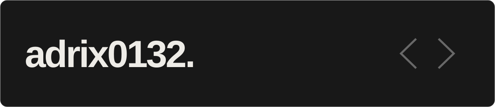

  

  <a href="https://github.com/adrix0132?tab=repositories">Mes dépôts</a>
  &nbsp; · &nbsp;
  <a href="https://thedev.world/u/adrix0132">thedev.world</a>

## Salut, moi c'est Adrix.

Je développe des outils en Python, des plugins pour PocketMine et des interfaces web. Ici, je partage mes projets : de la gestion de serveurs Minecraft au contrôle d'un robot depuis le navigateur.

**Dans mes projets :** `Python` · `PHP` · `JavaScript` · `HTML`

## Quelques projets

### [PocketMine Panel](https://github.com/adrix0132/pocketmine_panel)
Un panneau de gestion pour les serveurs PocketMine-MP : démarrage, arrêt, mises à jour et accès à la console.

**Python** · Gestion de serveurs

### [mBot Control](https://github.com/adrix0132/mbot-control)
Une interface web pour envoyer des commandes à un robot mBot en Bluetooth depuis le navigateur.

**JavaScript / HTML** · Web Bluetooth

### [JoinMessage](https://github.com/adrix0132/JoinMessageFR)
Des plugins PocketMine pour afficher un message à l'arrivée et au départ des joueurs. Disponibles en [français](https://github.com/adrix0132/JoinMessageFR) et en [anglais](https://github.com/adrix0132/JoinMessageEN).

**PHP** · Plugins Minecraft

---

  
Mon activité sur thedev.world

   

  

